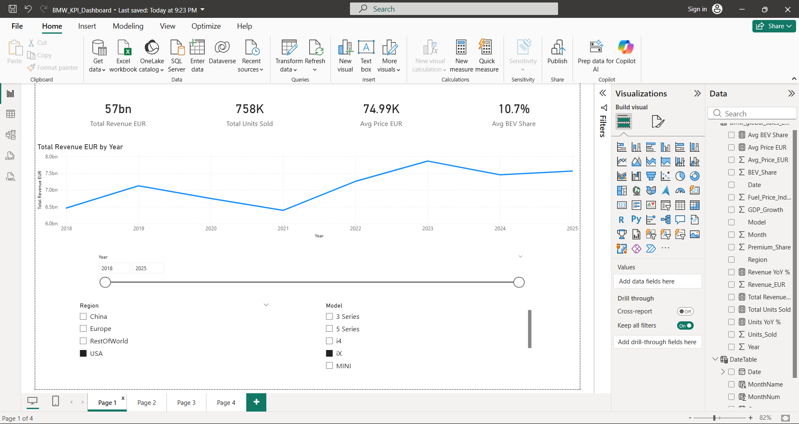
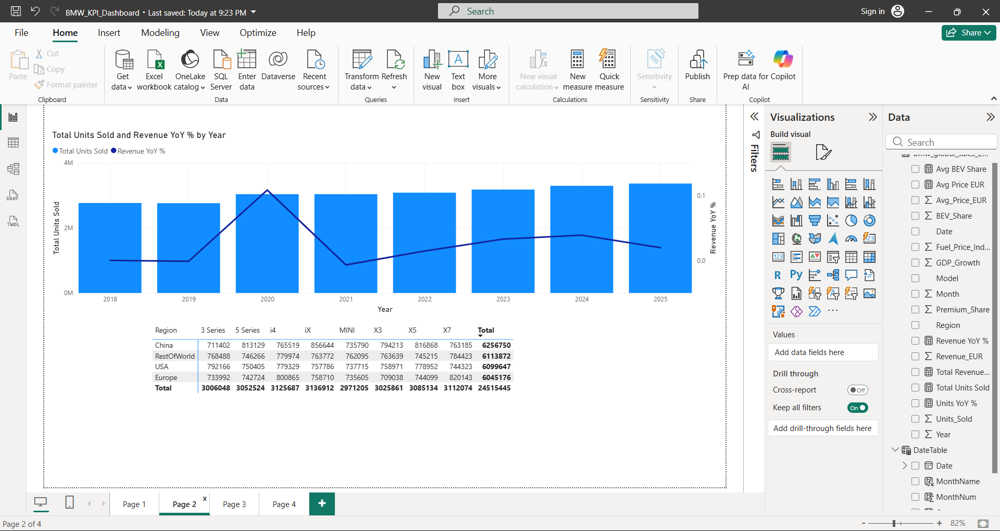
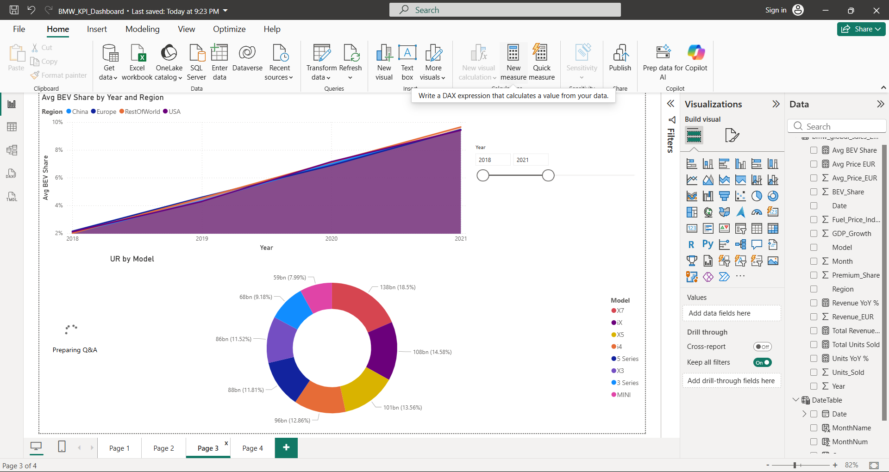
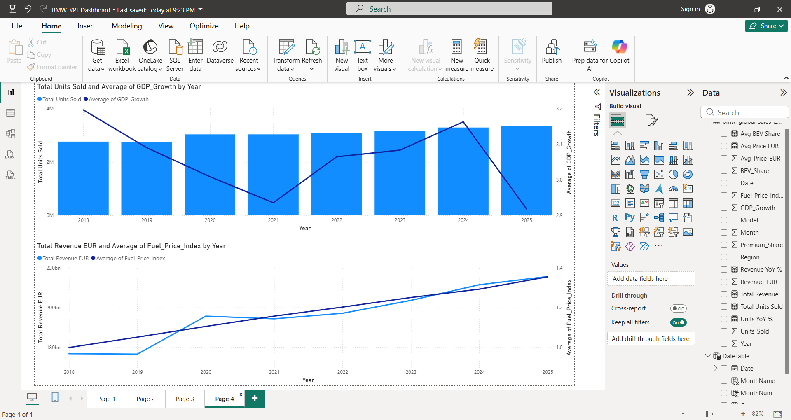

# BMW Global Sales KPI Dashboard

## Overview
A 4-page interactive Power BI dashboard analysing BMW's 
global sales performance across 2018–2025.

## Key Metrics
- Total Revenue: €31bn
- Total Units Sold: 738K  
- Average Selling Price: €41.86K
- Average BEV Share: 10.7%

## Dashboard Pages
- **Page 1** — Executive Summary: KPI cards, revenue trend, slicers
- **Page 2** — Sales Performance: YoY growth combo chart, Region × Model matrix
- **Page 3** — EV & Product Mix: BEV adoption area chart, revenue donut
- **Page 4** — Market Context: GDP correlation, fuel price analysis

## Tools Used
Power BI Desktop · DAX · Data Modelling · Time Intelligence

## Data
3,072 rows | 2018–2025 | 4 Regions | 8 Models | 11 columns

## How to View
Download `BMW_KPI_Dashboard.pbix` and open in Power BI Desktop

## Screenshots

